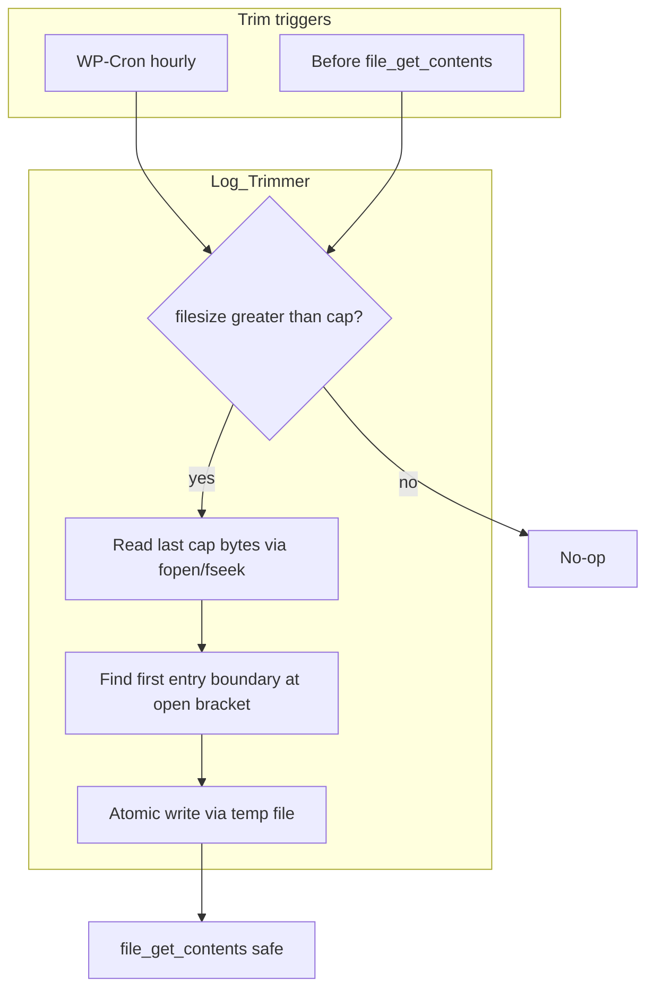

# Debug log size cap and auto-trim

## Problem

The admin UI loads the **entire** log into memory in [`classes/class-debug-log.php`](classes/class-debug-log.php) before any safeguard:

```463:464:classes/class-debug-log.php
        // Read the errors log file 
        $log 	= file_get_contents( $debug_log_file_path );
```

`array_slice( $lines, -100000 )` only limits **parsed** rows after the full file is already in RAM. If `debug.log` exceeds `memory_limit`, opening **Tools → Debug Log Manager** or AJAX `get_latest_entries` can fatal.

There is **no** cron, **no** memory checks, and **clear log** is the only file mutation today ([`clear_log()`](classes/class-debug-log.php) uses `file_put_contents( '', '' )`).

## Approach

Two complementary triggers (cron alone is insufficient):



**Cap (fixed, per your choice):** `75%` of PHP `memory_limit` (bytes via `wp_convert_hr_to_bytes()`). If `memory_limit` is `-1` (unlimited), fall back to **64 MB** before applying 75% (~48 MB cap) so trimming still has a bounded target.

Trim logic must **not** load the full file—only read up to `cap` bytes from the tail, then rewrite the file.

## New class: `DLM\Classes\Log_Trimmer`

**File:** [`classes/class-log-trimmer.php`](classes/class-log-trimmer.php)

| Method | Responsibility |
|--------|----------------|
| `get_max_log_size_bytes()` | Returns `(int) floor( limit_bytes * 0.75 )`; when `memory_limit` is `-1`, use **64 MB** as the base before applying 75% |
| `maybe_trim_log( $path = null )` | Resolve path from `debug_log_manager_file_path`; return early if missing/not a file or `filesize <= cap` |
| `trim_log_file( $path, $max_bytes )` | Tail-read implementation |

### Tail-trim algorithm (memory-safe)

1. `filesize( $path )` → if `<= $max_bytes`, return.
2. `fopen( $path, 'rb' )`, `fseek( -$max_bytes, SEEK_END )` (or `0` if file smaller than cap).
3. `fread()` the tail chunk into a string (bounded memory).
4. Find the first `[` in the chunk that starts a log entry boundary (skip a possible partial first line). Use a conservative regex aligned with existing parsing, e.g. first `\[` followed by a WordPress-style date fragment (`\d{2}-[A-Za-z]{3}-\d{4}`) within the next ~30 chars.
5. Keep `substr( $chunk, $boundary_offset )`.
6. Optionally prepend a single-line notice (same bracket format) so admins know history was trimmed, e.g. `[{date} UTC] Debug Log Manager: Older log entries were removed to stay within the size limit.`
7. Write atomically: `file_put_contents( $temp, $content )` then `rename( $temp, $path )` in the same directory (same pattern as core updates). Use `@` suppression only where the plugin already does for filesystem ops, or check return values and bail without corrupting the original on failure.

**Entry boundaries:** Matches how [`get_processed_entries()`](classes/class-debug-log.php) splits on `[` after protecting escaped brackets—trimming at a `[` + timestamp boundary keeps the newest entries parseable.

**Edge case:** One log line larger than the cap → keep the last `cap` raw bytes even if it splits an entry (still better than a fatal).

## WP-Cron scheduling

**Hook:** `dlm_trim_debug_log`  
**Schedule:** `hourly` (good balance for busy sites; cheap no-op when under cap)

| Event | Action |
|-------|--------|
| Plugin activation | [`classes/class-activation.php`](classes/class-activation.php) — `wp_schedule_event( time(), 'hourly', 'dlm_trim_debug_log' )` if not already scheduled |
| Plugin deactivation | [`classes/class-deactivation.php`](classes/class-deactivation.php) — `wp_clear_scheduled_hook( 'dlm_trim_debug_log' )` |
| Existing installs (upgrade without re-activate) | In [`bootstrap.php`](bootstrap.php) constructor (or `Debug_Log_Manager::__construct`), if `! wp_next_scheduled( 'dlm_trim_debug_log' )`, schedule once |

**Callback:** Register in `bootstrap.php`:

```php
add_action( 'dlm_trim_debug_log', [ $log_trimmer, 'maybe_trim_log' ] );
```

Cron runs whenever the plugin is active (log file may exist even when logging is disabled—admin can still open the page).

## Integration points (critical)

### 1. Before every full-file read

In [`Debug_Log::get_processed_entries()`](classes/class-debug-log.php), immediately before `file_get_contents()`:

```php
$trimmer = new Log_Trimmer();
$trimmer->maybe_trim_log( $debug_log_file_path );
```

This protects:

- Initial admin page render (`get_entries_datatable()`)
- AJAX auto-refresh (`get_latest_entries()`)
- Enabling logging when it calls `get_processed_entries()` after copying an existing huge log

### 2. Cron background maintenance

`Log_Trimmer::maybe_trim_log()` on `dlm_trim_debug_log`—prevents unbounded growth between admin visits.

### 3. Optional: after migration copy

In `toggle_debugging()` when copying from default/custom `debug.log`, call `maybe_trim_log()` after `file_put_contents` merge so enabling logging does not immediately copy an oversized file and then fatal on first parse.

## Files to change

| File | Change |
|------|--------|
| **New** [`classes/class-log-trimmer.php`](classes/class-log-trimmer.php) | Cap calculation + trim implementation |
| [`classes/class-debug-log.php`](classes/class-debug-log.php) | Pre-read trim in `get_processed_entries()`; post-copy trim in `toggle_debugging()` |
| [`classes/class-activation.php`](classes/class-activation.php) | Schedule cron |
| [`classes/class-deactivation.php`](classes/class-deactivation.php) | Clear cron hook |
| [`bootstrap.php`](bootstrap.php) | Instantiate trimmer, register cron action, ensure schedule on load |
| [`debug-log-manager.php`](debug-log-manager.php) | Version bump + changelog note when releasing |

**No new settings UI** (fixed 75% cap).

## Security and conventions

- Trim only the path from `get_option( 'debug_log_manager_file_path' )`; verify `is_file()` and path stays under uploads / expected location (same trust model as existing `clear_log()`).
- Cron callback needs no nonce (server-side); no public exposure.
- Prefer `fopen`/`fread`/`rename` for trim (consistent with existing `file_put_contents` usage in the plugin; WP_Filesystem is not used elsewhere here).
- i18n for the optional trim notice line if displayed in the log (English string is fine inside bracket format; translators comment if wrapped).

## Testing plan

1. **Under cap:** Log &lt; 75% memory → cron and pre-read no-op; page loads normally.
2. **Over cap:** Artificially grow log (loop `error_log()` or copy large file) → open admin page → file shrinks, page loads, footer size updates.
3. **Cron:** `wp cron event run dlm_trim_debug_log` (WP-CLI) or wait for hourly event → filesize drops without visiting admin.
4. **Enable logging with huge legacy log:** Copy path in `toggle_debugging()` → trim runs → no fatal on first table build.
5. **Unlimited memory (`-1`):** Cap uses 64 MB fallback (~48 MB after 75%); trim still runs.
6. **Deactivate:** Scheduled hook removed (`wp_next_scheduled` false).

## Future (out of scope)

- Streaming/chunked parse instead of `file_get_contents()` (larger refactor; trim solves the immediate fatal).
- User-configurable cap % or toggle (deferred per your preference).
- Admin notice when a trim occurred on page load (optional UX polish).

# BUILD

Implementation is complete for **2.5.0**. Summary:

### New: [`classes/class-log-trimmer.php`](classes/class-log-trimmer.php)
- **`get_max_log_size_bytes()`** — 75% of `memory_limit`; if unlimited (`-1`), uses **64 MB** base (~48 MB cap)
- **`maybe_trim_log()`** — no-op when file is missing or under cap
- **`trim_log_file()`** — tail-read via `fopen`/`fseek`/`fread`, finds first `[dd-Mon-yyyy` entry boundary, prepends a trim notice, writes atomically via temp file + `rename`

### Cron
- **Activation** — schedules `dlm_trim_debug_log` hourly
- **Deactivation** — clears the scheduled hook
- **Bootstrap** — ensures schedule exists on upgrade; registers cron callback

### Integration
- **`get_processed_entries()`** — trims before `file_get_contents()`
- **`toggle_debugging()`** — trims after copying a legacy log when enabling logging

### Version
- Bumped to **2.5.0** in `debug-log-manager.php` and `README.md` changelog

### Verification
Standalone test: 22.5 MB log trimmed to ~500 KB with the notice line at the top. Unlimited-memory cap returns **50331648** bytes (75% of 64 MB).

On a live site you can confirm cron with: `wp cron event run dlm_trim_debug_log` (WP-CLI).