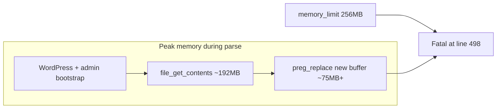

# Fix memory exhaustion in `get_processed_entries()`

## Root cause

The error occurs in [`classes/class-debug-log.php`](classes/class-debug-log.php) inside `get_processed_entries()`:

```490:514:classes/class-debug-log.php
        // Read the errors log file 
        $log 	= file_get_contents( $debug_log_file_path );
        // ...
		$log = preg_replace("/\[([a-zA-Z\s\-]+)\]/", "$1", $log);
        // ... multiple str_replace on full string ...
        $lines 	= explode("[", $log);
        $lines 	= array_slice( $lines, -100000 );
```

**What triggers it:** Opening the Debug Log Manager admin page, AJAX auto-refresh (`get_latest_entries()`), or any code path that calls `get_processed_entries()`.

**Why line 498 specifically:** PHP reports the line where the *next* allocation failed. By line 498, `file_get_contents()` has already loaded the entire log (~150–192 MB on a 256 MB host). `preg_replace()` then tries to allocate a second full-size buffer (~75 MB in your case), pushing total usage past `memory_limit` (268435456 bytes = 256 MB).



**Why `Log_Trimmer` (2.5.0+) did not prevent this:** [`classes/class-log-trimmer.php`](classes/class-log-trimmer.php) caps the file at **75%** of `memory_limit` (~192 MB on your host). That cap protects disk usage and very large reads, but `get_processed_entries()` still parses a large in-memory string and creates more copies than the cap leaves room for:

| Step | Extra memory |
|------|----------------|
| `file_get_contents` | ~1× file size |
| `preg_replace` | ~1× file size (new string) |
| `str_replace` × 4 | additional copies |
| `explode` | array of string fragments |
| Per-entry `wp_kses_post` + HTML building | grows with entry count |

`array_slice( $lines, -100000 )` only limits **parsed rows after** the full file is already in RAM — it does not help peak memory.

---

## Tightened fix (code-only, next release)

The original plan's direction was close, but one part needs correction: the `str_replace()` calls that protect `"[\\", "[\"", ":[", "[internal function]"` cannot be moved after `explode( '[' , ... )`, because they are specifically there to stop false entry boundaries before the split happens.

Use three complementary changes instead:

### 1. Add a dedicated parser read window instead of lowering the global trim cap

In [`classes/class-log-trimmer.php`](classes/class-log-trimmer.php):

- Keep the existing `CAP_PERCENT = 75` for background trimming and log-retention behavior unless testing later shows that policy itself is too generous.
- Add a separate helper for UI parsing, for example `get_parse_window_bytes()` plus `read_tail_chunk( $path, $max_bytes )`, so the admin screen only reads a conservative tail window.
- Size the parser window independently from the trim cap. A good target is a small bounded chunk, e.g. **up to ~32 MB** on normal hosts, or a conservative fraction of `memory_limit` on smaller hosts.

This is safer than lowering the trim cap to 25%, because it fixes the admin-page fatal without unexpectedly deleting more log history on every site.

### 2. Replace the full-file read with a bounded tail read

In [`classes/class-debug-log.php`](classes/class-debug-log.php), `get_processed_entries()` should stop using full-file `file_get_contents()` for admin parsing:

- Keep `maybe_trim_log( $debug_log_file_path )` as the existing background/maintenance safeguard.
- Replace `file_get_contents( $debug_log_file_path )` with the new bounded tail-read helper.
- Run the current false-split protections on that bounded raw chunk **before** `explode( '[' , ... )`:
  - `str_replace( "[\\", "^\\", $log )`
  - `str_replace( "[\"", "^\"", $log )`
  - `str_replace( ":[", ":^", $log )`
  - `str_replace( "[internal function]", "^internal function^", $log )`
- `explode( '[', $log )`, then immediately `unset( $log )` to release the raw chunk as soon as possible.

This change addresses the real problem: the UI does not need the whole file in memory just to show the latest parsed entries.

### 3. Reduce avoidable parser copies without breaking split behavior

In `get_processed_entries()`, move only the bracket-label regex to per-line processing, after the split, inside the existing `foreach ( $lines as $line )` loop:

```php
$line = preg_replace( '/\[([a-zA-Z\s\-]+)\]/', '$1', $line );
```

That regex strips secondary tags like `[DEBUG]` or `[WARNING]` from a single entry, so it is safe to defer until after splitting.

Keep the existing per-line reversal of the temporary placeholders later in the method (`"^\\", "^\"", ":^", "^internal function^"`), because that logic already assumes the replacements happened before splitting.

Result: peak memory should drop from “large file plus multiple full-file copies” to “bounded tail chunk plus split-array overhead”, which is a much more reliable fit within 256 MB.

---

## Files to change

| File | Change |
|------|--------|
| [`classes/class-log-trimmer.php`](classes/class-log-trimmer.php) | Add parser-window sizing and bounded tail-read helper; keep storage trim cap unchanged for now |
| [`classes/class-debug-log.php`](classes/class-debug-log.php) | Replace full-file read with bounded tail read; move only regex cleanup per-line; `unset( $log )` immediately after explode; optional graceful failure if read fails |
| [`debug-log-manager.php`](debug-log-manager.php) | Version bump at release time, if this ships in a new plugin version |

No new settings UI. Cron (`dlm_trim_debug_log`) can continue to use the current `maybe_trim_log()` behavior unchanged.

---

## Out of scope (future, larger refactor)

- Full streaming parser with `SplFileObject` or manual reverse chunk iteration
- Paginated admin UI (load N entries per AJAX request)
- Revisit the 75% storage trim cap after production testing, as a separate retention-policy change

These are not needed if the bounded tail-read keeps parser memory well below the host limit.

---

## Test plan

1. **Large log below trim cap:** Use a log large enough to stress parsing but still below the existing 75% trim threshold → admin page loads because the parser only reads the bounded tail window.
2. **Large log above trim cap:** Verify `maybe_trim_log()` still trims oversized logs, then confirm the admin parser reads only the bounded tail chunk.
3. **False-split regression:** Confirm entries containing `[\"`, `[\\`, `:[`, and `[internal function]` still remain single entries after parsing.
4. **Tag-cleanup regression:** Confirm `[DEBUG]`, `[INFO]`, `[WARNING]`, and similar secondary bracket tags are still removed correctly when the regex runs per-line.
5. **Timezone + stack trace regression:** Confirm non-UTC timezone parsing and PHP Fatal stack traces still render correctly.
6. **Read/trim failure:** Simulate a failed tail read or failed trim and verify the method returns a safe empty/error payload instead of fatalling.
7. **Cron:** `wp cron event run dlm_trim_debug_log` still trims oversized logs without visiting admin.

# BUILD

Implemented the memory-exhaustion fix in `classes/class-debug-log.php` and `classes/class-log-trimmer.php`.

`get_processed_entries()` no longer loads the full log with `file_get_contents()`. It now:
- validates the log path up front and returns an empty JSON payload on failure
- keeps the existing `maybe_trim_log()` safeguard
- reads only a bounded tail chunk via a new `Log_Trimmer::read_tail_chunk()` helper
- frees the raw chunk immediately after `explode()` with `unset( $log )`
- drops a leading partial fragment when the tail read starts mid-file

`Log_Trimmer` now has dedicated parser-window logic separate from the existing 75% storage trim cap:
- `get_parse_window_bytes()` caps admin parsing to a conservative window
- `read_tail_chunk()` returns only the newest bounded portion of the log
- shared tail-read logic was centralized so trimming and parsing use the same boundary-aware chunk reader

One safe adjustment was required during implementation: the `[DEBUG]` / `[INFO]` bracket-label cleanup stays on the bounded raw chunk before `explode()`. Moving it after the split, as the plan suggested, caused false entry splits in regression testing.

Verification:
- `php -l classes/class-log-trimmer.php`
- `php -l classes/class-debug-log.php`
- no linter errors on the edited files
- custom PHP regression harness passed for bounded tail reads, entry-boundary alignment, delimiter shielding/restoration, and missing-file fallback

A good next check is a manual test on a site with a very large `debug.log` to confirm the admin screen now loads and shows the latest entries without exhausting memory.