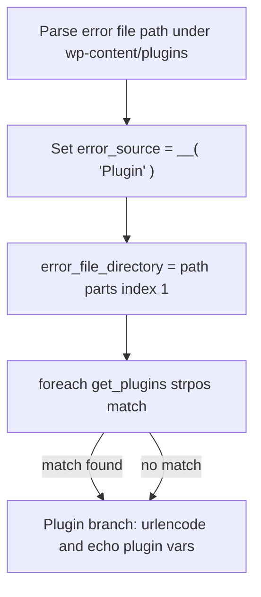

# Fix undefined plugin source variables in `get_processed_entries()`

## Relevance: still present

The December 2025 log entries reference lines **1565–1566**; in the current tree those line numbers sit in the **Theme** branch, but the **same Plugin-branch logic** still exists at **1571–1575** in [`classes/class-debug-log.php`](classes/class-debug-log.php). Nothing in recent changes (e.g. log trimmer) addresses this path.

The warnings occur inside `Debug_Log::get_processed_entries()` while building HTML for log entries—so Debug Log Manager can **log new warnings about itself** while parsing `debug.log`.



When lookup fails, the Plugin HTML block still runs and reads unset variables → four reported issues:

| Warning | Line (current) | Cause |
|---------|----------------|-------|
| Undefined `$error_source_plugin_path_file` | 1571 | Never assigned in `foreach` |
| `urlencode(): Passing null` | 1571 | Same unset var passed to `urlencode()` |
| Undefined `$error_source_plugin_name` | 1572, 1575 | Never assigned |
| Undefined `$error_source_plugin_uri` | 1572, 1575 | Never assigned |

## Root cause analysis

### 1. Plugin metadata only set on `foreach` match

Assignment happens only inside a loose `strpos` match:

```1467:1475:classes/class-debug-log.php
					if ( 'Plugin' == $error_source ) {
						foreach ( $plugins as $plugin_path_file => $plugin_info ) {
							if ( false !== strpos( $plugin_path_file, $error_file_directory ) ) {
								$error_source_plugin_path_file = $plugin_path_file;
								$error_source_plugin_name = $plugin_info['Name'];
								$error_source_plugin_uri = $plugin_info['PluginURI'];
							}
						}
					}
```

There is **no `break`**, **no fallback**, and **no per-iteration initialization** of `$error_source_plugin_*`. If no row matches (or matching is wrong), variables stay undefined.

### 2. Fragile directory extraction (`[1]` not `[0]`)

```1458:1461:classes/class-debug-log.php
					if ( ( 'Plugin' == $error_source ) || ( 'Theme' == $error_source ) ) {
						$error_file_path_parts = explode( '/', $error_file_path );
						$error_file_directory = $error_file_path_parts[1];
					}
```

After stripping `WP_PLUGIN_DIR`, the relative path is usually `/debug-log-manager/classes/...` → index `[1]` = `debug-log-manager` (correct).

If the stripped path ever lacks a leading slash (e.g. `debug-log-manager/classes/...`), index `[1]` becomes `classes` instead of the plugin slug → **lookup fails** while `$error_source` remains `Plugin` → display block triggers warnings. This is a plausible failure mode on some server/path combinations.

### 3. No guard before use in display block

```1569:1576:classes/class-debug-log.php
				} elseif ( 'Plugin' == $error_source ) {
					if ( ! defined( 'DISALLOW_FILE_EDIT' ) || ( false === constant( 'DISALLOW_FILE_EDIT' ) ) ) {
						$file_viewer_url = get_admin_url() . 'plugin-editor.php?file=' . urlencode( substr( $error_file_path, 1 ) ) . '&plugin=' . urlencode( $error_source_plugin_path_file );
						$error_details = '...' . $error_source_plugin_uri . '...' . $error_source_plugin_name . '...';
```

The branch keys only on `$error_source`, not on whether metadata was resolved.

### 4. Secondary issue: logic vs display string mismatch (i18n)

`$error_source` is set with `__()` but compared to literal `'Plugin'` / `'Theme'` / `'WordPress core'`. With no shipped `.po` files this usually stays English today, but it is brittle once translations exist. **Recommendation:** use internal slugs for comparisons; use translated strings only in output.

### 5. Related Theme risk (not in your log, same pattern)

Theme branch at 1567 uses `$error_source_theme_uri` when `wp_get_theme()->exists()` is false (only name fallback is set). Worth fixing in the same pass for consistency.

---

## Proposed fix (minimal, focused)

All changes in [`classes/class-debug-log.php`](classes/class-debug-log.php), inside `get_processed_entries()` loop (~1382–1577).

### Step 1: Initialize metadata variables each iteration

In the existing “Initialize error-related variables” block (~1382), add:

- `$error_source_plugin_path_file = ''`
- `$error_source_plugin_name = ''`
- `$error_source_plugin_uri = ''`
- `$error_source_theme_dir = ''`
- `$error_source_theme_name = ''`
- `$error_source_theme_uri = ''`

### Step 2: Extract plugin/theme slug reliably

Replace `$error_file_path_parts[1]` with first path segment after normalizing:

```php
$relative_path = ltrim( $error_file_path, '/' );
$slug = strtok( $relative_path, '/' );
```

Use `$slug` as `$error_file_directory` (or rename for clarity).

### Step 3: Tighten plugin lookup + fallback

Replace loose `strpos( $plugin_path_file, $error_file_directory )` with prefix match:

- `0 === strpos( $plugin_path_file, $slug . '/' )`
- OR `$plugin_path_file === $slug . '.php'` (single-file plugins)

On first match: set the three plugin vars and **`break`**.

If no match: set fallback display values (mirror theme’s else branch):

- `$error_source_plugin_name = $slug`
- leave URI/path empty or omit links in output

### Step 4: Guard Plugin (and Theme) display blocks

Before building `$file_viewer_url` / links:

- Only call `urlencode( $error_source_plugin_path_file )` when `$error_source_plugin_path_file` is non-empty.
- Only output plugin/theme URI and name links when URI/name are non-empty; otherwise plain text label (folder slug).

This removes PHP 8.1+ `urlencode(null)` deprecation and undefined-variable warnings even when lookup fails.

### Step 5 (optional but recommended): Internal source slugs

Refactor to store e.g. `$error_source_key = 'plugin'` for `if` checks, and a separate `$error_source_label = __( 'Plugin', ... )` for HTML. Keeps future translations from breaking detection. Small diff if done only for the three source types in this function.

---

## Verification

Manual test via Debug Log Manager UI (or calling `get_processed_entries()` on a site with `WP_DEBUG_LOG`):

1. **Happy path** — Error under `wp-content/plugins/debug-log-manager/classes/class-debug-log.php` shows plugin name link, file editor link (if `DISALLOW_FILE_EDIT` is false), no new warnings in `debug.log`.
2. **Lookup failure** — Simulate or use a log line under `wp-content/plugins/unknown-folder/file.php` with no registered plugin: entry still renders with slug text, **no** undefined-variable or `urlencode(null)` warnings.
3. **Leading-slash edge** — Confirm slug extraction works for both `/plugin/file.php` and `plugin/file.php` relative paths after strip.
4. **Regression** — Theme and WordPress core entries still render correct source/file/line blocks.

No new files or dependencies required.

---

## Summary of changes (for plan doc after build)

_To be appended to [`.cursor/plans/debug_log_size_cap_298b2b84.plan.md`](.cursor/plans/debug_log_size_cap_298b2b84.plan.md) only if you want this tracked there; otherwise this plan stands alone._

# BUILD

Implemented the fix in [`classes/class-debug-log.php`](classes/class-debug-log.php) inside `get_processed_entries()`. Summary:

### Changes

1. **Per-entry initialization** — Reset `$error_source_key`, `$error_file_directory`, and all plugin/theme metadata variables to empty strings each loop iteration.

2. **Internal source keys** — Use `$error_source_key` (`core`, `theme`, `plugin`) for logic; keep `$error_source` as the translated label for display only.

3. **Reliable slug extraction** — Replace `explode(...)[1]` with `ltrim()` + `strtok()` so both `/debug-log-manager/...` and `debug-log-manager/...` resolve to the correct plugin/theme folder.

4. **Stricter plugin lookup** — Match with `slug/file.php` or `slug.php` prefix rules, `break` on first hit, and fall back to the folder slug as the display name when no plugin is registered.

5. **Guarded output** — Plugin/theme blocks only build external URI links when URIs exist, and only build editor URLs when `plugin` path file or `theme` dir is known — avoiding undefined variables and `urlencode(null)` on PHP 8.1+.

6. **Theme fallback** — When `wp_get_theme()` does not find a theme, set `$error_source_theme_dir` so file paths still work, and omit the URI link when it is empty.

PHP syntax check passes. Slug extraction was verified for leading-slash and no-leading-slash paths.

On a live site, reload the Debug Log Manager admin page and confirm no new self-referential warnings appear in `debug.log` when viewing entries from plugins, themes, and core.