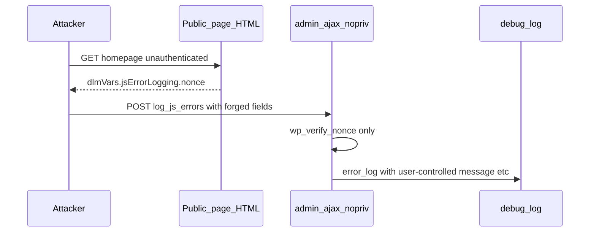

# Patch CVE-2026-9016: Unauthenticated log injection via `log_js_errors`

## Validation summary

The disclosure is **valid for the current codebase (v2.5.0)**. All core claims match the source.

| Claim | Status | Evidence |
|-------|--------|----------|
| Unauthenticated AJAX handler | **Confirmed** | [`bootstrap.php`](bootstrap.php) L133–134 registers both `wp_ajax_log_js_errors` and `wp_ajax_nopriv_log_js_errors` |
| Public nonce exposure | **Confirmed** | [`bootstrap.php`](bootstrap.php) L556–571: when `debug_log_manager` status is `enabled` and `debug_log_manager_js_error_logging` is `enabled`, `wp_create_nonce( DLM__SLUG )` is output via `wp_localize_script()` on every frontend page |
| No authorization beyond nonce | **Confirmed** | [`classes/class-debug-log.php`](classes/class-debug-log.php) L1991: only `wp_verify_nonce( $request['nonce'], DLM__SLUG )` — no capability check, no referer/origin check, no rate limit |
| User-controlled `error_log()` output | **Confirmed** | L2001 concatenates sanitized request fields into a single log line |
| Exploitation requires JS logging enabled | **Confirmed** | `public_scripts()` only enqueues `dlm-public` when both options are `enabled` |

### Attack flow (current)



### Nuances on PoC specifics

1. **Unauthenticated log injection** — fully reproducible. Any visitor (or bot) that fetches a public page once can obtain a valid nonce and POST arbitrary “JavaScript Error” lines.

2. **Newline / log-structure injection via `pageUrl`** — the PoC assumes `sanitize_text_field()` leaves `\n` intact. In WordPress core, `_sanitize_text_fields()` **replaces `\r`, `\n`, and `\t` with spaces** when `$keep_newlines` is false (the default for `sanitize_text_field()`). Classic `\n` injection is likely **blocked by core** on current WP. Still treat as a real class of risk: add explicit control-character stripping (NUL, vertical tab, Unicode line/paragraph separators) as defense-in-depth.

3. **Admin UI spoofing without newlines** — still impactful. The log parser in `get_processed_entries()` classifies entries by **substring** on the message body (L1520+), checking `PHP Fatal` **before** `JavaScript Error` (L1556). An attacker can set `message` to e.g. `PHP Fatal error: injected-fake-entry` and the forged line is stored as `JavaScript Error: PHP Fatal error: ...` but may display as **PHP Fatal** in the Debug Log Manager UI.

4. **Admin-context logging** is lower risk: [`admin.js`](assets/js/admin.js) only loads on the plugin settings page, and the nonce is not globally exposed in wp-admin. The same handler is still nonce-only for authenticated `wp_ajax` calls — worth tightening with a capability check.

---

## Chosen approach (per your preference)

**Keep `wp_ajax_nopriv_log_js_errors`** for anonymous frontend JS error logging, and apply layered hardening per Wordfence guidance.

---

## Implementation plan

### 1. Add a dedicated log sanitizer

Create a small private method (or namespaced helper) in [`classes/class-debug-log.php`](classes/class-debug-log.php), e.g. `sanitize_log_field( $value, $max_length = 500 )`:

- Run `sanitize_text_field()` first (reuse WP conventions)
- Strip all ASCII control chars (`\x00-\x1F`, `\x7F`)
- Strip Unicode line/paragraph separators (`U+2028`, `U+2029`)
- Collapse repeated whitespace to a single space
- Enforce max length with `mb_substr()` (avoid log bloat / DoS-by-volume)

Apply to **all five** user fields: `message`, `script`, `lineNo`, `columnNo`, `pageUrl`.

### 2. Use a fixed, non-spoofable log prefix

Change L2001 from:

```php
error_log( 'JavaScript Error: ' . $message . ' ...' );
```

to a constant prefix defined once in the class, e.g.:

```php
error_log( '[DLM JS] ' . $message . ' in ' . $script . ' on line ' . $line_number . ' column ' . $column_number . ' at ' . get_site_url() . $page_url );
```

- Prefix must be a **PHP constant/literal**, never derived from request data
- Prevents impersonation of `[date] PHP Fatal error:` style core entries
- Backward compatibility: update parser at L1556 to match both `[DLM JS]` (new) and `JavaScript Error:` (legacy entries already in existing logs)

### 3. Harden `log_js_errors()` entry checks

In [`classes/class-debug-log.php`](classes/class-debug-log.php) `log_js_errors()`:

**a) Preconditions (early exit / `wp_die()`):**
- Reject if `debug_log_manager` logging is not `enabled` OR `debug_log_manager_js_error_logging` is not `enabled` (mirror `public_scripts()` conditions)
- Reject if `WP_DEBUG` / logging to file is not active (optional but avoids writing when logging is off)

**b) Referer / Origin validation (nopriv only):**
- For unauthenticated requests, require `HTTP_ORIGIN` or `HTTP_REFERER` host to match `wp_parse_url( home_url(), PHP_URL_HOST )` (use `wp_safe_redirect` pattern / `wp_http_validate_url` style comparison)
- Allow missing Origin on same-site XHR where Referer is present; fail closed if both are absent or external

**c) Rate limiting:**
- Key: `dlm_js_log_{hash( IP + user agent )}` via `set_transient()` / `get_transient()`
- Suggested default: **30 requests / 60 seconds / IP** (tunable constant)
- On exceed: `wp_die( '', '', 429 )` or silent `wp_die()` to avoid oracle behavior

**d) Capability check for authenticated admin logging:**
- When `is_user_logged_in()` and request includes `type === 'wp-admin'` (already sent by [`admin.js`](assets/js/admin.js) L466), require `current_user_can( 'manage_options' )` (or `activate_plugins` — align with who can view Tools → Debug Log Manager)
- Public frontend requests (`type === 'front end'` from [`public.js`](assets/js/public.js) L16) skip capability but still get referer + rate limit

**e) Nonce:**
- Keep `wp_verify_nonce( $request['nonce'], DLM__SLUG )` for backward compatibility with cached pages
- Optionally add a dedicated nonce action string (e.g. `dlm-log-js-errors`) in a follow-up release; not required for the security fix if other layers are in place

### 4. Fix parser misclassification

In [`classes/class-debug-log.php`](classes/class-debug-log.php) `get_processed_entries()` (~L1520):

- Add a **first** branch for `[DLM JS]` and legacy `JavaScript Error:` before the generic `PHP Fatal` substring checks
- Ensures injected `PHP Fatal error:` strings inside DLM JS lines classify as **JavaScript**, not PHP Fatal

### 5. Minor request-handling cleanup

- Replace `json_decode( urldecode( file_get_contents( 'php://input' ) ), true )` with `json_decode( file_get_contents( 'php://input' ), true )` and update [`public.js`](assets/js/public.js) / [`admin.js`](assets/js/admin.js) to `xhr.send( JSON.stringify( data ) )` without `encodeURI()` — reduces parsing ambiguity (separate small change, test both clients)

### 6. Version and changelog

- Bump plugin version in [`debug-log-manager.php`](debug-log-manager.php) (e.g. `2.5.1` security release)
- Add changelog entry referencing CVE-2026-9016

---

## Files to change

| File | Changes |
|------|---------|
| [`classes/class-debug-log.php`](classes/class-debug-log.php) | Sanitizer, hardened `log_js_errors()`, parser prefix branch |
| [`bootstrap.php`](bootstrap.php) | No hook removal; optional: document security constants |
| [`assets/js/public.js`](assets/js/public.js) | Remove `encodeURI()` on send (if input parsing is updated) |
| [`assets/js/admin.js`](assets/js/admin.js) | Same JSON send fix |
| [`debug-log-manager.php`](debug-log-manager.php) | Version bump |

---

## Test plan

1. **Regression — legitimate frontend error**
   - Enable debug logging + JS error logging
   - Trigger `window.onerror` on a public page (or inject test script)
   - Confirm `[DLM JS]` entry appears in `debug.log` and shows as **JavaScript** in the admin table

2. **Block unauthenticated abuse**
   - Fetch nonce from homepage HTML
   - POST forged payload with `message: PHP Fatal error: TEST_INJECT` without valid referer/origin → expect rejection
   - POST 40+ requests in 1 minute from same IP → expect rate limit

3. **Legacy log compatibility**
   - Ensure existing `JavaScript Error:` lines still parse correctly

4. **Admin logging**
   - As admin on Tools → Debug Log Manager page, trigger JS error → logs successfully
   - As subscriber (if nonce obtainable), confirm request is denied by capability check

5. **Plugin Check / PHPCS**
   - Run existing project lint/PCP if available

---

## Risk notes

- **Referer/Origin checks** can break logging on sites that strip referer headers (rare for same-origin XHR). Document in release notes; consider a filter `dlm_js_error_log_skip_origin_check` for edge cases.
- Rate limiting by IP is imperfect behind NAT but sufficient to stop mass automated injection.
- Removing `encodeURI`/`urldecode` is a behavior change — test with real browser `onerror` events containing special characters.

# BUILD

CVE-2026-9016 is patched in **v2.5.1**. Summary of what changed:

### Security hardening (`classes/class-debug-log.php`)

- **`sanitize_log_field()`** — strips control chars, Unicode line separators, collapses whitespace, enforces max length on all request fields
- **`is_js_error_logging_enabled()`** — rejects requests when logging or JS error logging is disabled
- **`validate_request_origin()`** — unauthenticated requests must have same-site `Origin` or `Referer` (skippable via `dlm_js_error_log_skip_origin_check` filter)
- **`check_js_error_rate_limit()`** — 30 requests per 60 seconds per IP+UA
- **`log_js_errors()`** — capability check (`manage_options`) for `wp-admin` requests; fixed **`[DLM JS]`** log prefix; JSON body parsed without `urldecode()`
- **Parser** — `[DLM JS]` and legacy `JavaScript Error:` are classified **before** `PHP Fatal` substring checks

### Client updates

- [`assets/js/public.js`](assets/js/public.js) and [`assets/js/admin.js`](assets/js/admin.js) — send raw JSON via `JSON.stringify()` (no `encodeURI`)

### Release

- Version bumped to **2.5.1** in `debug-log-manager.php` and [`README.md`](README.md) with changelog entry

### Manual verification (on your WP site)

1. Trigger a real frontend JS error → confirm `[DLM JS]` appears in `debug.log` as **JavaScript** in the admin table  
2. Replay the PoC without a valid referer/origin → should get `wp_die` (no injection)  
3. Confirm existing `JavaScript Error:` lines still parse correctly  
4. Admin page JS errors still log when logged in as admin

# Q&A

Will the max_length value = 500 in sanitize_log_field() be sufficiently large for PHP fatal errors that includes a lengthy stack trace?

**No — but that limit does not apply to PHP fatal errors or stack traces.**

`sanitize_log_field()` is only used inside `log_js_errors()` for **browser-submitted JavaScript error fields** (`message`, `script`, `lineNo`, `columnNo`, `pageUrl`). PHP fatal errors (including long stack traces) are written by PHP/WordPress directly to `debug.log` and are **never** passed through this function.

### What actually gets limited

From `public.js` / `admin.js`, the handler only receives what `window.onerror` provides:

```7:17:assets/js/public.js
	window.onerror = function(msg, url, lineNo, columnNo, error) {

		var data = {
			nonce: dlmVars.jsErrorLogging.nonce,
			message: msg,
			script: url,
			lineNo: lineNo,
			columnNo: columnNo,
			pageUrl: window.location.pathname + window.location.search,
			type: 'front end'
		}
```

The fifth `error` argument (which can hold `error.stack`) is **not sent**. So stack traces are not logged for JS errors today, regardless of the 500-character cap.

Applied limits in the handler:

| Field | Max length |
|-------|------------|
| `message` | 500 (default) |
| `script` | 500 |
| `lineNo` / `columnNo` | 20 |
| `pageUrl` | 500 |

### Is 500 enough for those JS fields?

**Usually yes** for typical cases:

- **message** — often short (`Uncaught TypeError: ...`), though some browsers can produce longer messages.
- **script** — can be a long bundled URL; 500 may truncate very long CDN/cache-busted paths.
- **pageUrl** — query strings can exceed 500 on some sites.

Also, `sanitize_log_field()` **collapses all whitespace to a single space**, so multi-line stack content would be flattened even if you later started sending `error.stack`.

### Bottom line

- **PHP fatal + stack trace:** unaffected; read/parsed as-is from `debug.log`.
- **Current JS logging:** 500 is ample for normal `onerror` payloads; the bigger practical gap is that **stacks are not logged at all**, not that 500 is too small.
- **Future enhancement:** if you add `error.stack` to the AJAX payload, you’d want a higher limit (or a separate field/limit) and probably avoid collapsing newlines in that field.

If you want to raise limits or add stack logging, switch to **Agent mode** and we can implement that.

---

Is $_SERVER['HTTP_ORIGIN'] and $_SERVER['HTTP_REFERER'] safe from spoofing? i.e. can't they be forged?

**No — they are not trustworthy as authentication.** Both `HTTP_ORIGIN` and `HTTP_REFERER` are ordinary request headers. Anything that can POST to `admin-ajax.php` (curl, Python, Postman, a bot) can set them to whatever it wants, including your site’s host.

### What Origin/Referer actually block

They help mainly in **browser-driven, cross-site** cases:

- A script on `evil.com` doing XHR/fetch to your site will send `Origin: https://evil.com` (or no Origin), not your host — so your check in `validate_request_origin()` would reject it.
- Browsers generally **do not let page JS change `Origin`** on cross-origin requests (unlike custom headers you might add).

They do **not** stop someone who:

1. Fetches your public page once (gets the nonce), then  
2. Sends crafted POSTs with headers like:
   - `Origin: https://yoursite.com`
   - `Referer: https://yoursite.com/`

That matches the original CVE flow: nonce from HTML + direct AJAX POST. Forging those headers is trivial outside the browser.

### Referer vs Origin

| Header   | Spoofable by direct HTTP client? | Notes |
|----------|----------------------------------|--------|
| `Origin` | Yes                              | Often absent on same-origin navigations; present on XHR/fetch POST |
| `Referer`| Yes                              | Can be stripped by browser policy, privacy tools, or HTTPS→HTTP downgrade |

So they are **not** a substitute for real auth. They’re a **light filter**: block dumb bots and wrong-origin browser traffic, not a determined attacker with the public nonce.

### How this fits your patch

In your hardened `log_js_errors()`, real risk reduction comes from the **combination**:

- Option gating (logging must be enabled)
- Nonce (weak alone because it’s public, but still required)
- **Rate limiting** (hurts mass injection)
- **`sanitize_log_field()`** (limits injection shape/size)
- **Fixed `[DLM JS]` prefix** (harder to impersonate PHP errors in the UI)
- **Capability check** for `wp-admin` requests
- Origin/Referer — **defense in depth only**

Wordfence’s guidance treats Origin/Referer as **additional contextual checks**, not primary authorization — which matches how they’re used here.

### If you needed stronger guarantees

You’d need something attackers can’t copy from public HTML alone, e.g.:

- Don’t expose a nopriv endpoint (only log for logged-in users), or  
- A server-issued secret bound to session/cookie (still scrapeable if an attacker loads the page), or  
- Accept that anonymous frontend logging is inherently abusable and rely on rate limits + log labeling/sanitization (your current approach).

**Bottom line:** Treat `$_SERVER['HTTP_ORIGIN']` and `$_SERVER['HTTP_REFERER']` as **hinting filters**, not proof the request came from a real visitor on your site. They’re worth having, but they don’t fix the core issue that the nonce is public.