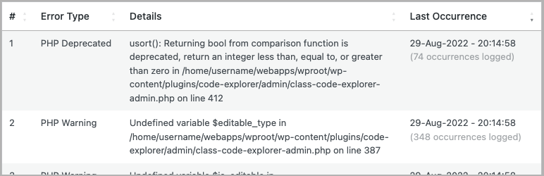
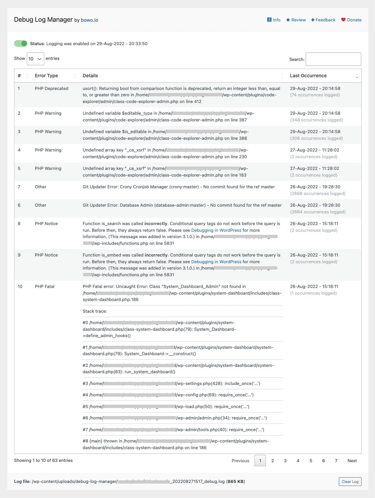
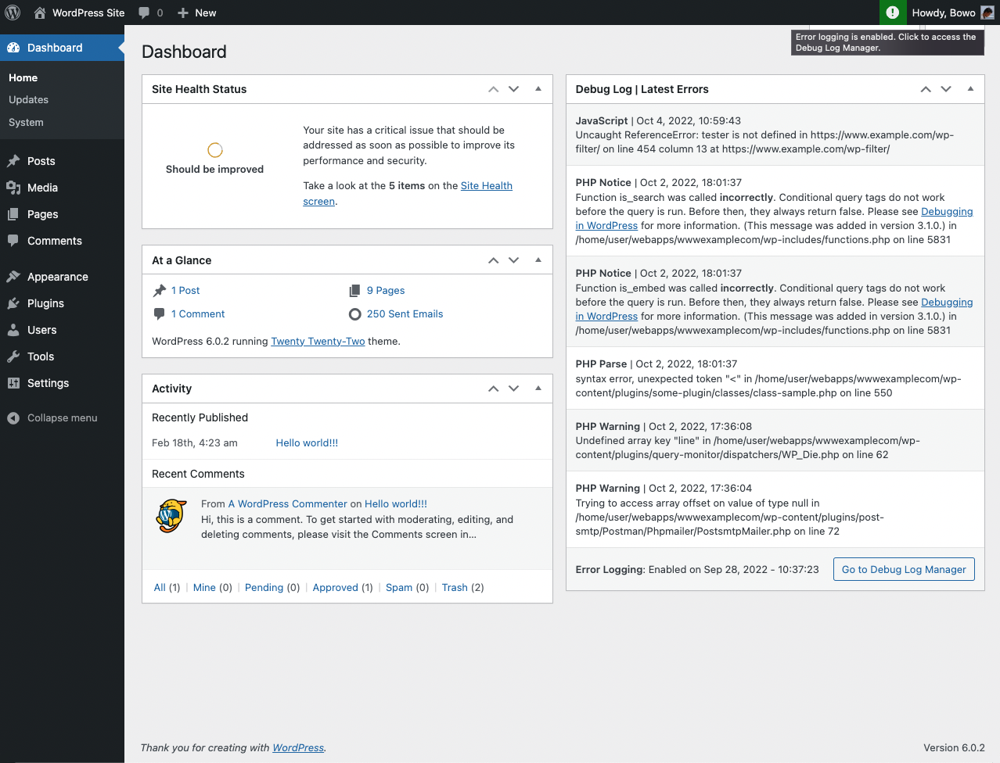
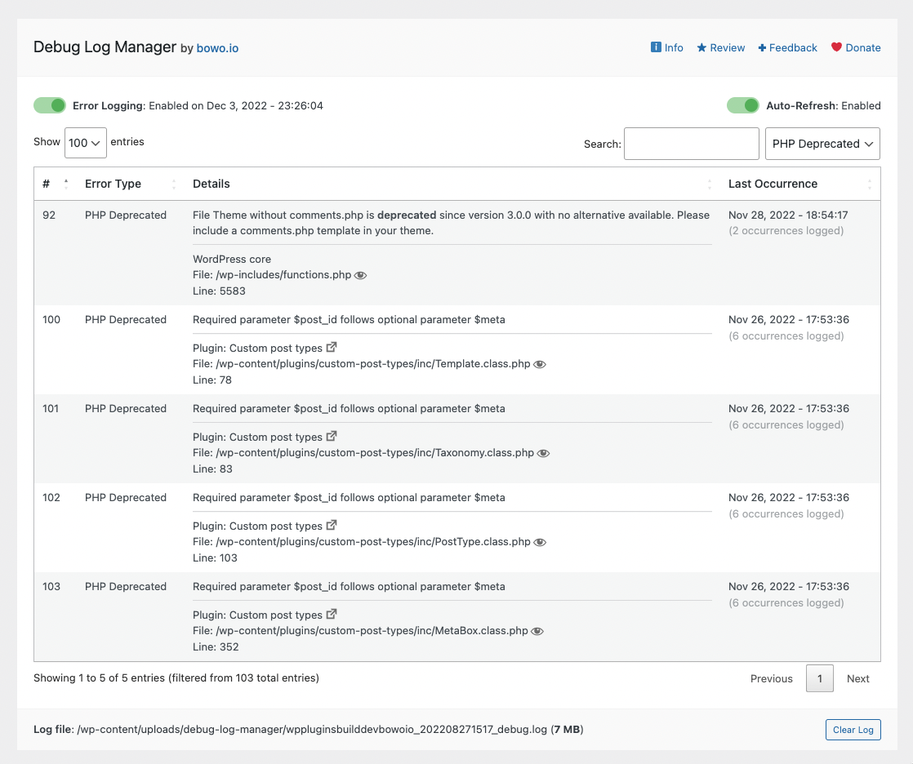
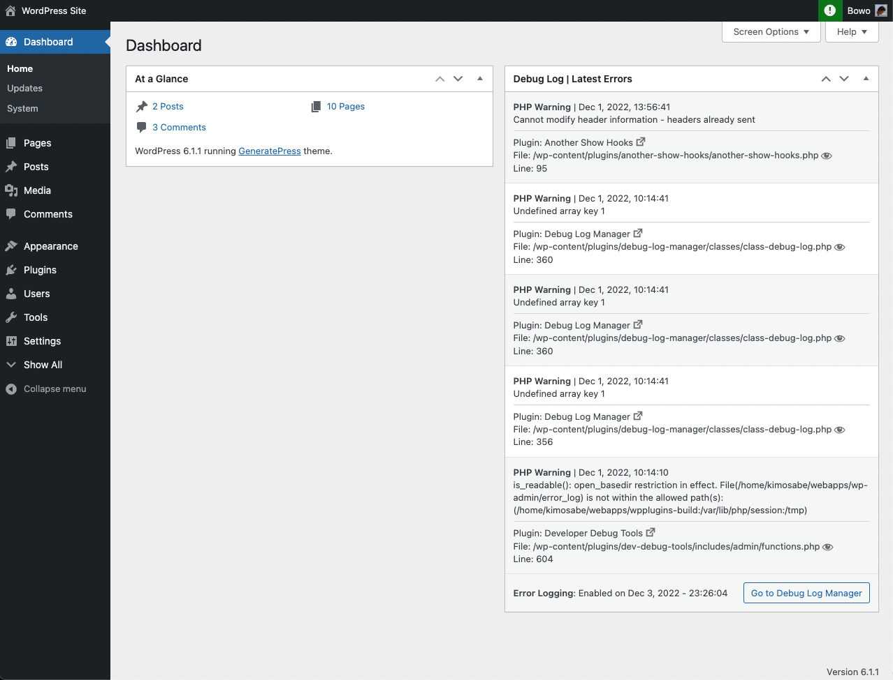

# Debug Log Manager

Contributors: qriouslad  
Donate link: https://bowo.io/dotorg-sponsor-dlm  
Tags: debug, errors, developer  
Requires at least: 4.6  
Tested up to: 6.4.3  
Stable tag: 2.3.3  
Requires PHP: 5.6  
License: GPLv2 or later  
License URI: http://www.gnu.org/licenses/gpl-2.0.html



Log PHP, database and JavaScript errors via WP_DEBUG with one click. Conveniently create, view, filter and clear the debug.log file.

## Description

Debug Log Manager allows you to: 

* **Enable [WP_DEBUG](https://wordpress.org/support/article/debugging-in-wordpress/) with one click to log PHP, database and JavaScript errors** when you need to, and disable it when you're done. No need to manually edit wp-config.php file. 
* **Create the debug.log file for you** in a non-default location with a custom file name for enhanced security. 
* **Copy the content of the default / existing debug.log file** into the custom debug.log file, and delete the default / existing debug.log file. So there is continuation in logging and enhanced security going forward.
* Parse the debug.log file and **view distinct errors and when they last occurred**, which is better than looking at the raw log file (potentially) full of repetitive errors. 
* **Quickly find and filter more specific errors** for your debugging work.
* **Make error details easier to read** by identifying error source (core / plugin / theme) and separating file path and line number.
* **Easily view files where PHP errors occurred**. This includes WordPress core, plugin and theme files.
* **Enable auto-refresh** to automatically load new log entries. No need to manually reload the browser tab, or to ```tail -f``` the log file on the command line.
* **Easily clear the debug.log file** to save disk space and more easily observe newly occurring errors on your site.
* **Show an indicator on the admin bar** when error logging is enabled.
* **Add a dashboard widget** showing the latest errors logged.
* **Use `error_log()`** to output error info into your debug log. e.g. `error_log( $error_message )` for simple, string-based error message, or `error_log( json_encode( $error ) )` when inspecting a more complex error info, e.g. array or object.

A simpler and more compact version of Debug Log Manager is included as part of the [System Dashboard plugin](https://wordpress.org/plugins/system-dashboard/), should you prefer a single plugin that does more.

### What Users Say

_"This is **a great plugin for dev** especially for people who tinker in the code."_ ~[PK Son](https://wordpress.org/support/topic/great-for-dev/)

_"I have used a couple of other logger plugins and **this is by far the best one**."_ ~[Brian Henry](https://wordpress.org/support/topic/must-have-plugin-485/)

_"**Another massive time-saving tool.**"_ ~[Jeff Starr](https://digwp.com/2023/06/plugins-troubleshoot-debug-wordpress/)

### Give Back

* [A nice review](https://bowo.io/review-dlm) would be great!
* [Give feedback](https://bowo.io/feedback-dlm) and help improve future versions.
* [Help translate](https://translate.wordpress.org/projects/wp-plugins/debug-log-manager/) into your language.
* [Github repo](https://bowo.io/github-dlm) to contribute code.
* [Sponsor](https://bowo.io/dotorg-sponsor-dlm) my work.

### Check These Out Too

* [System Dashboard](https://wordpress.org/plugins/system-dashboard/): Central dashboard to monitor various WordPress components, processes and data, including the server.
* [Variable Inspector](https://wordpress.org/plugins/variable-inspector/): Inspect PHP variables on a central dashboard in wp-admin for convenient debugging.
* [Admin and Site Enhancements](https://wordpress.org/plugins/admin-site-enhancements/) helps you to easily enhance various admin workflows and site aspects while replacing multiple plugins doing it.
* [WordPress Newsboard](https://www.wpnewsboard.com/): The latest news, articles, podcasts and videos from 100+ WordPress-focused sources.

## Screenshots

1. Debug Log Manager main page
   
2. Fatal errors with the stack trace
   
3. More log entries sample
   
4. Admin bar indicator and dashboard widget
   

## Frequently Asked Questions

### Will this work with the managed WordPress hosting I am on?

Maybe. It's been tested with Kinsta and GridPane (with Secure Debug turned off). If you find it's not working with your managed host, please post in the support forum about the issue / error you encounter. I may ask for a test site that I can work with.

### How was this plugin built?

Debug Log Manager is built using the excellent [WPConfigTransformer class](https://plugins.svn.wordpress.org/debug-log-config-tool/tags/1.1/src/Classes/vendor/WPConfigTransformer.php) from [WP Debug Log – Config Tool](https://wordpress.org/plugins/debug-log-config-tool/), [DataTables.js](https://datatables.net/), [jSticky](https://github.com/AndrewHenderson/jSticky) and [jQuery Toast](https://github.com/kamranahmedse/jquery-toast-plugin).

## Changelog

### 2.3.3 (2024.03.20)

* Properly escape unescaped $variables for improved security. Making good use of the excellent [Plugin Check (PCP)](https://wordpress.org/plugins/plugin-check/) plugin.

### 2.3.2 (2024.03.20)

* Fixed XSS vulnerability responsibly disclosed by [Majed Refaea](https://patchstack.com/database/researcher/c2b35ecd-36ee-47b9-a1b2-b892578ab685) via pathstack.
* Fixed Broken Access Control vulnerability responsibly disclosed by [Majed Refaea](https://patchstack.com/database/researcher/c2b35ecd-36ee-47b9-a1b2-b892578ab685) via pathstack.
* Fixed CSRF attack vulnerability responsibly disclosed by [Dhabaleshwar Das](https://patchstack.com/database/researcher/135acf3e-049d-4657-a7b8-f5406b06bf4d) via pathstack.
* Enable detection of change in WordPress installation path, e.g. when pushing from dev to production, or migrating to new host, and update the debug log file location settings. This should fix issue where the debug log entry viewer stopped working on such scenarios. To make sure Debug Log Manager works on the new site / destination, please deactivate and reactivate it. Props to [@jeswd](https://wordpress.org/support/users/jeswd/) for reporting it [here](https://wordpress.org/support/topic/stops-working-when-path-to-wordpress-app-changes/) and [@jrmyfranck](https://wordpress.org/support/users/jrmyfranck/) and [@drhnews](https://wordpress.org/support/users/drhnews/) for reporting it [here](https://wordpress.org/support/topic/breaks-when-install-path-changes/).

### 2.3.1 (2023.11.30)

* Improved the randomness of the debug log file name for improved security. 

### 2.3.0 (2023.11.29)

* Improved parsing of log entries with more than one set of bracketed info, e.g. [timestamp] [WARNING] detail info about error. It was parsed as "No error message specified...". Props to [@azzuwayed](https://wordpress.org/support/users/azzuwayed/) for providing the [one important line of code](https://wordpress.org/support/topic/ignore-messages-with-square-brackets/) with the right preg_replace regex pattern to fix that. I find people who can churn out regex patterns as needed to have a special superpower!

### 2.2.2 (2023.11.29)

* **[SECURITY]** Improved security of ajax call to clear log file. Authorized only for site admins and secured to prevent CSRF with nonce. Props to Dmitrii Ignatyev again for reminding to check on this one as well.

### 2.2.1 (2023.11.29)

* **[IMPORTANT][SECURITY]** Fixed a security issue where the debug log manager directory can be opened in the browser allowing visitors to see and download the debug log file which may contain sensitive information. **Once you update to v2.2.1, please visit the debug log page at least once**. This will create an empty index.php file in the DLM directory and prevent the issue. This vulnerability was responsibly disclosed by Dmitrii Ignatyev from CleanTalk inc. on November 2, 2023. Apologies if this took me a while to get around to as I was fully occupied with the launch of [ASE Pro](https://www.wpase.com).

### 2.2.0 (2023.06.26)

* Hide dashboard widget and admin bar icon for non-administrator users
* Stop public.js from loading on the frontend if logging is disabled

### 2.1.4 (2023.04.15)

* Add link to [WordPress Newsboard](https://bowo.io/wpn-dlm) in footer
* **[SPONSORSHIP]** If you like or have benefited from this plugin in your **personal project(s), paid work and/or client site(s)**, please kindly consider [sponsoring the ongoing development and maintenance](https://bowo.io/dotorg-sponsor-dlm) of this plugin (and [my other plugins](https://profiles.wordpress.org/qriouslad/#content-plugins)) from as little as USD 1 / month. Thank you!

### 2.1.3 (2023.02.25)

* Fixed "Undefined offset" error. Props to [@guyinpv](https://profiles.wordpress.org/guyinpv/) for [reporting the issue](https://wordpress.org/support/topic/undefined-offset-log-message/).

### 2.1.0 (2023.02.21)

* Correctly parse the content of entries added via the `error_log()` function. Instead of `print_r()`, please use `json_encode()`, if you're trying to output a PHP `$variable` containing an array or object into the debug log. e.g. `error_log( json_encode( $variable_name ) )`. Props to [@guyinpv](https://profiles.wordpress.org/guyinpv/) for [reporting the issue](https://wordpress.org/support/topic/doesnt-show-full-message/).

### 2.0.0 (2022.12.03)

* WordPres core, plugin or theme files where PHP errors occurred can now be easily viewed by simply clicking on the file path in each error entry. This is done using core's plugin/theme editor (modified to load in view-only mode) and the [wordpress-develop](https://github.com/WordPress/wordpress-develop) repo on Github for core files.
* SCRIPT_DEBUG constant is now set to true in wp-config when error logging is enabled, which should help with debugging javascript errors.
* Added a button to disable plugin/theme editor below the error entries table. This is for when you're done with debugging, i.e. you've disabled error logging and cleared the debug log file, and wants to keep things secure.

### 1.9.1 (2022.12.02)

* Fixed styling issue for external link dashicon in entries when datatable is auto-refreshed.

### 1.9.0 (2022.12.02)

* Detect PHP Exception error type and add it to the entries table filter.
* Make error entries easier to read by identifying error source (core / plugin / theme) and separating file path and line number.

### 1.8.7 (2022.10.22)

* Fix for missing wp_date() function for WordPress before v5.3.
* Suppress all admin notices when viewing log entries. Thanks to [a nice patch](https://github.com/qriouslad/debug-log-manager/pull/4) from [@brianhenryie](https://wordpress.org/support/topic/first-impressions-8/#post-16042768).
* Improve inline comments for some of the code.

### 1.8.6 (2022.10.09)

* Fix wrong reference to old app.js. Change to admin.js.

### 1.8.5 (2022.10.08)

* Smooth out the behaviour of scroll-to-fix-on-top the position of DLM page's header.
* Change default number of entries to show on dashboard widget from 10 to 5.

### 1.8.4 (2022.10.08)

* Fix for syntax error as [reported by @michel-jongbloed](https://wordpress.org/support/topic/fatal-error-after-update-123/).

### 1.8.3 (2022.10.07)

* CSS fix for dashboard widget to ensure error messages wrap properly, i.e. not overflow the widget container.

### 1.8.2 (2022.10.05)

* CSS fixes for dashboard widget footer as well as main page header and footer sizing.

### 1.8.0 (2022.10.02)

* Add dashboard widget showing the latest errors logged, the error logging status and a link to the Debug Log Manager page.

### 1.7.0 (2022.09.28)

* Internationalize the plugin. i.e. make it ready for localization (translation into various languages). Do help [make Debug Log Manager available in your language](https://translate.wordpress.org/projects/wp-plugins/debug-log-manager/). Thank you!

### 1.6.4 (2022.09.27)

* Fix PHP Warning issue: "Trying to access array offset on value of type bool" reported by [@brianhenryie](https://wordpress.org/support/topic/first-impressions-8/#post-16042768) and [@hogash](https://github.com/qriouslad/debug-log-manager/issues/2).

### 1.6.3 (2022.09.27)

* Further fixes (HTML, CSS, JS) to ensure error details are properly wrapped inside the data table and not cause the table to overflow the page width. This includes scenarios when auto-refresh is enabled and pagination is in use.

### 1.6.2 (2022.09.26)

* CSS fix to ensure error details are properly wrapped inside the data table and not cause the table to overflow the page width.

### 1.6.1 (2022.09.26)

* Improve detection of anchor text in wp-config.php for the WP_Config_Transformer class. Make sure toggling of WP_DEBUG works for wp-config.php that uses either "Happy publishing" or "Happy blogging".

### 1.6.0 (2022.09.25)

* Add admin bar status icon. Will only show up if error logging is enabled and on pages other than the Debug Log Manager main page, including the front end.

### 1.5.3 (2022.09.24)

* Improve log parser for handling error messages that contain the # and [ characters, e.g. "Argument #1" or "[internal function]"

### 1.5.2 (2022.09.22)

* Disable auto-refresh when pagination is used. Otherwise, table will always go back to the first page.

### 1.5.1 (2022.09.21)

* Fix typo in Error Type dropdown filter for 'JavaScript' preventing filter to work properly for this error type.

### 1.5.0 (2022.09.21)

* Add Error Type dropdown filter.

### 1.4.0 (2022.09.21)

* JavaScript errors on wp-admin and the front end is now logged by default.
* Improve copy around error types for simplicity and clarity.
* Fix an issue where AJAX calls for the auto-refresh feature won't properly stop in multiple scenarios of clicking the Error Logging and/or Auto-Refresh toggles.

### 1.3.3 (2022.09.20)

* Bug fix: undefined function wp_filesize() in bootstrap.php. Props to [@gleysen](https://wordpress.org/support/users/gleysen/) for [reporting it](https://wordpress.org/support/topic/error-when-loading-2/).

### 1.3.1 (2022.09.18)

* Fix bugs around the auto-refresh feature. Disabling auto-refresh works only on the toggle and wp_option entry but not on the actual ajax calls. If auto-refresh is enabled, it only worked on clicking the toggle but not on page load. Both issues are fixed.

### 1.3.0 (2022.09.18)

* Implement toast notifications on various action completions, e.g. clearing log file.
* Change date format to M j, Y - H:i:s, e.g. Dec 31, 2021 - 20:06:34.
* Implment auto-refresh feature that will automatically load the latest error entries every 5 seconds.

### 1.2.0 (2022.09.16)

* Fix detection of existing debug log file, if there is one, so it is copied correctly into DLM's debug log file.
* Auto update entries table when logging is enabled, including when copying entries from existing debug.log file.
* Code refactor: added autoloader of plugin's PHP classes.

### 1.1.0 (2022.09.13)

* Improve implementation of [WP PHP Coding Standards](https://developer.wordpress.org/coding-standards/wordpress-coding-standards/php/) across the codebase.
* Improve variable sanitization and escaping.
* Set initial data table sort based on the # column so that Last Occurence column is properly sorted according to the timestamp.
* Add get_value() method to WP_Config_Transformer class to work with existing debug log constants in wp-config.php.
* Enable $options argument for the add() and update() method in WP_Config_Transformer to ensure formatting of debug log constants is correct in wp-config.php.

### 1.0.1 (2022.08.31)

* Refactor code for better organization and maintainability.
* Improve plugin description / README.md.

### 1.0.0 (2022.08.29)

* Initial stable release. 